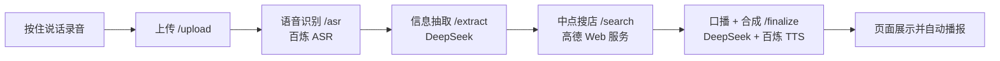

# 语音约碰面

说一句话，帮你和朋友找中间的碰面地点。

按住麦克风说出两人各自所在位置和想做什么（例如：「我在杭州东站，朋友在蒋村地铁站，在哪碰面合适」），松开后几秒内即可看到识别文字、两个地址、中点附近推荐地点，并自动播报口播结果。

## 链路示意



文字版：

`录音 → 上传 → ASR 转写 → 抽取地址与品类 → 地理编码与中点周边搜索 → 生成口播文案 → TTS 合成 → 前端展示与播放`

## 技术栈

| 层级 | 技术 |
|------|------|
| 前端 | React、Vite、Axios |
| 后端 | Python、FastAPI、httpx、uvicorn |
| 外部服务 | 阿里云百炼 ASR（`qwen3-asr-flash`）、百炼 TTS（`qwen3-tts-flash`）、DeepSeek Chat（`deepseek-v4-flash`）、高德 Web 服务 API（地理编码 / 周边搜索） |

## 本地运行

### 1. 后端（端口 8003）

```bash
cd backend
python3 -m venv .venv
source .venv/bin/activate   # Windows: .venv\Scripts\activate
pip install -r requirements.txt
cp .env.example .env        # 填入下方环境变量
uvicorn main:app --reload --port 8003
```

浏览器可打开 `http://127.0.0.1:8003/docs` 调试接口。

### 2. 前端（端口 5175）

另开一个终端：

```bash
cd frontend
npm install
npm run dev
```

浏览器打开 `http://127.0.0.1:5175`（或 Vite 终端里提示的地址）。

## 环境变量（`backend/.env`）

从 `backend/.env.example` 复制后填写（**不要把真实 Key 提交进仓库**）：

```bash
BAILIAN_API_KEY=your_bailian_api_key_here
DEEPSEEK_API_KEY=your_deepseek_api_key_here
AMAP_API_KEY=your_amap_web_service_key_here
```

| 变量名 | 用途 |
|--------|------|
| `BAILIAN_API_KEY` | 百炼 ASR + TTS |
| `DEEPSEEK_API_KEY` | 信息抽取与口播文案 |
| `AMAP_API_KEY` | 高德地理编码与周边搜索 |

## 已知限制

- 依赖语音识别质量：口语含糊、噪声大时，地址抽取容易失败或不准。
- 地址需能被高德地理编码识别；过于口语/模糊的地名可能搜不到。
- 周边搜索受中点与品类影响；部分区域可能暂时找不到合适地点。
- 浏览器可能拦截自动播报，需手动点「播放口播」。
- 中点为两人坐标简单取平均，未考虑路网与交通便利性。
- 口播与推荐默认偏「咖啡店」等品类表述，复杂意图覆盖有限。

## 下一步计划

- [ ] 优化中点策略（路网距离、地铁可达等）
- [ ] 支持用户在推荐列表中手动改选后再播报
- [ ] 加强 ASR / 抽取失败时的引导与重试体验
- [ ] 补充自动化测试与更清晰的错误码约定
- [ ] 部署到可分享的线上环境（前后端分离部署）
